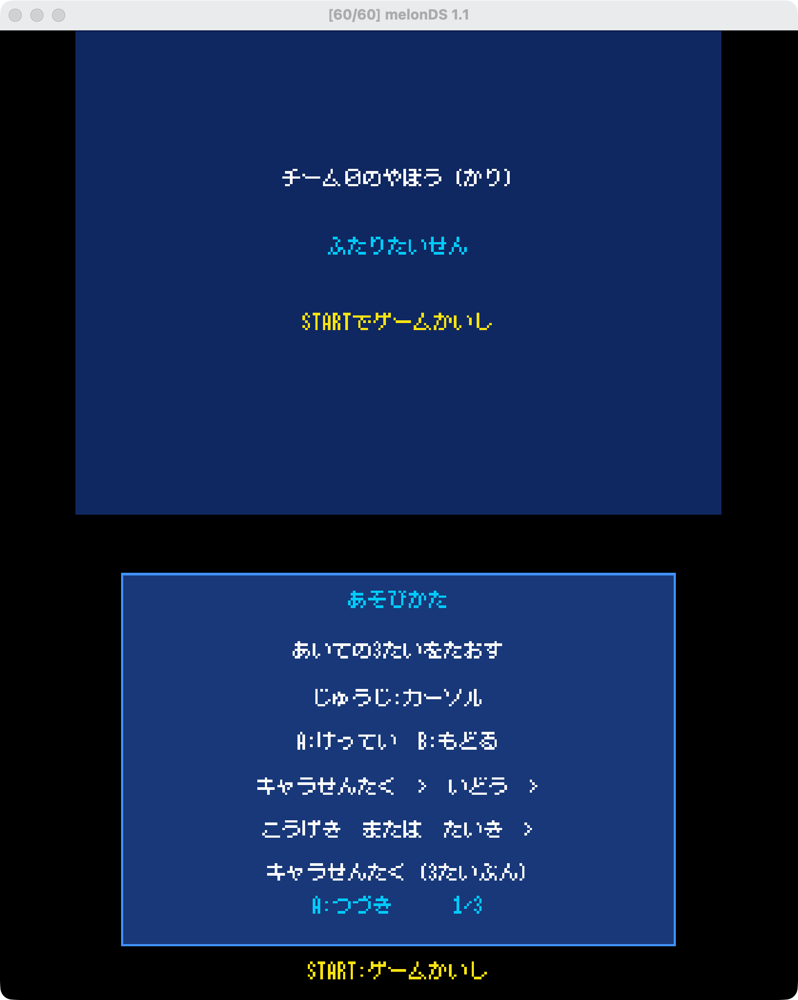
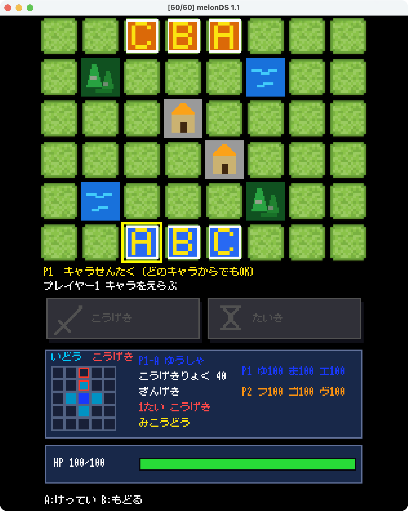

# チーム０のやぼう（仮）

Nintendo DSi向けにC言語とBlocksDSで制作した、1台交代操作式の2人対戦ターン制タクティクスゲーム。
各プレイヤーが特性の異なる3体を動かし、相手チームの全滅を目指す。

<p align="center">
  
  
</p>

<p align="center"><em>タイトル・遊び方画面（左）／地形を含む盤面と対戦中の情報UI（右）</em></p>

## 制作概要

| 項目 | 内容 |
|---|---|
| ジャンル | 2人対戦ターン制タクティクス |
| 対応環境 | Nintendo DSi／Nintendo DS、melonDS |
| 開発言語・環境 | C、BlocksDS、libnds、Docker、VS Code Dev Containers |
| チーム | プログラミングサークルWINCの6人チーム |
| 制作機会 | WINC 2026年夏合宿 |
| 合宿での開発期間 | 企画、実装、実機確認、発表準備を含めて実質約2.5日間 |
| 操作方式 | 1台の本体を2人で受け渡す共通操作方式 |

合宿で安定して対戦できる版を完成させた後、講評とプレイ時の気付きをもとに、UI、覚醒、地形、ゲームバランスを追加・改善している。本リポジトリの`main`は、その改善を反映した版である。

## ゲームの特徴

- 上画面の8×6マス盤面と、下画面の情報・操作UIを連携
- 移動方法、攻撃範囲、攻撃力が異なる3種類のユニット
- 移動確定前に、移動先からの攻撃可能範囲をプレビュー
- 単体攻撃と範囲攻撃を、赤い攻撃範囲と黄色い対象枠で区別
- 味方を失った側が生存ユニットを1体選ぶ覚醒システム
- 山・湖・回復可能な建造物による位置取りの変化
- 行動済み表示、攻撃不能時の無効表示、全ユニットのHP一覧
- 日本語8×8ドットフォントによるタイトル、ルール、戦況表示
- 対戦中のBGM、選択時と勝敗決定時の効果音
- 勝敗画面とSTARTボタンによる再戦

## 制作背景と企画意図

チーム内に『ポケモン＋ノブナガの野望』が好きなメンバーがいたことをきっかけに企画した。同作を再現するのではなく、Nintendo DSi上で短期間に完成可能な規模へ発想を再構成し、異なるルールとキャラクター性能を持つ対戦ゲームとして設計した。

### 1台を囲んで遊ぶ

通信やプレイヤー別の操作系を用意せず、同じ十字キーとボタンを使ってターンごとに本体を受け渡す方式を採用した。開発規模を抑えるだけでなく、盤面を見ながら会話し、同じ場所で一緒に遊ぶ体験を意図している。

### DSiの2画面と小さな表示領域を活用する

上画面には盤面、ユニット、移動・攻撃範囲を表示し、下画面には選択中ユニットのHP、技、攻撃種別、各ユニットの状態、操作内容を表示する。小さな画面でも役割を判別できるよう、色、枠、ドット絵、日本語の短い表現を組み合わせた。

### 決定前に判断材料を見せる

移動後に初めて攻撃可否が分かる状態を避けるため、移動候補へカーソルを合わせた時点で、その位置からの攻撃可能範囲を表示する。移動と攻撃を一続きの戦術判断として比較できる設計である。

### 劣勢側にも選択肢を作る

各プレイヤーが最初に味方を失った後、次の自分ターン開始時に生存ユニットから1体を選んで覚醒させる。Aは前方への範囲攻撃、Bは横方向の範囲攻撃、Cは攻撃時の自己回復へ変化し、劣勢時にも編成と盤面に応じた判断が生まれるようにした。

## ゲームルール

Player 1から開始し、生存している自軍ユニットを好きな順番で1体ずつ行動させる。1体の行動は「移動または現在地に残る」「攻撃または待機」の順に進む。自軍の全員が行動すると相手のターンになり、相手の3体を先に倒した側が勝利する。

| ユニット | 通常攻撃力 | 覚醒攻撃力 | 移動・攻撃の特徴 |
|---|---:|---:|---|
| A | 40 | 70 | 上下左右へ移動。通常時は前方1〜2マス内の敵1体を攻撃し、覚醒後は範囲内の敵をまとめて攻撃 |
| B | 30 | 40 | 斜めと前方へ移動。2マス前の横3マス内から、通常時は敵1体、覚醒後は敵全員を攻撃 |
| C | 30 | 40 | 前方・左右・後方へ移動し、斜め4方向を攻撃。覚醒後は命中時に自身のHPを20回復 |

各プレイヤーは最初に味方を失った後、次の自分ターン開始時に生存ユニット1体を選んで覚醒させる。生存者が1体だけの場合は自動的に覚醒し、覚醒選択では行動回数を消費しない。

山と湖は進入不可。中央付近の建造物は進入でき、その上で自分のターンを迎えるとHPを20回復する。全ユニットの初期HPと最大HPは100。詳しい判定は[技術資料](mygame/docs/technical-notes.md)を参照。

## 操作

- 十字キー：カーソル移動、攻撃／待機の切り替え
- Aボタン：決定
- Bボタン：1段階戻る。移動後は移動前の位置へ戻る
- STARTボタン：ゲーム開始、勝敗決定後の再戦

## チーム開発とプロジェクトマネジメント

企画初期のアイデア出し、案の整理、盤面とUIの基本方針は、全員で1枚のホワイトボードを囲みながら決定した。その後、実装候補を次の情報とともにGitHub Issueへ分割した。

- ゲームの完成に対する優先度
- 現在のコードを踏まえた実装難易度と必要技術レベル
- 各メンバーの自己申告による技術レベル
- 各作業への希望・非希望
- 作業間の依存関係と競合の可能性

優先度を最初の判断基準としつつ、各メンバーが完了可能な難易度と、できる限り本人の希望に合う担当を組み合わせた。最初は各メンバーが1件をPull Requestまで進めることを目標とし、完了後に次のIssueへ進む段階的な割り当てを行った。作業が難航した場合は相談、レビュー、担当の引き継ぎによって、チーム全体で遊べる状態を完成させることを優先した。

開発開始前には、対戦に必要な機能を備えた[基盤MVP](https://github.com/YuTakane256/2026-summer-camp-tactics-mvp)を先行して用意した。これにより、チーム内で完成像とコード構成を早期に共有し、画面、画像、音源などを並行して追加できる土台を作った。

短期間ですべての案を実装するのではなく、まず安定して対戦できる版を確保し、その後に優先度の高いUIや素材を段階的に統合した。採用しなかった案も削除せず、検討した仕様、難易度、優先度を[Issue](https://github.com/winc1980/2026-summer-camp-teamZero/issues)へ残している。実装とレビューの過程は[Pull Request](https://github.com/winc1980/2026-summer-camp-teamZero/pulls?q=is%3Apr)から確認できる。

### メンバーと主な担当

| メンバー | GitHub | 主な担当 |
|---|---|---|
| 高根 | [@YuTakane256](https://github.com/YuTakane256) | Issue設計、優先順位付けと必要技術レベルの分類、メンバーの技術レベルと希望を集計したうえでのIssue担当調整、進捗確認、レビュー・統合、提出版管理などのプロジェクトマネジメント。基盤MVP、対戦中の行動UI、選択中ユニット情報、移動先からの攻撃範囲表示、覚醒・地形を含む追加機能の統合、技術資料の整理 |
| 古根川 | [@kh928965-dot](https://github.com/kh928965-dot) | BlocksDS開発環境と初期画面表示、下画面の攻撃ボタン、草地タイルの盤面表示、選択中ユニットのHPゲージ表示 |
| 三橋 | [@Mihashy](https://github.com/Mihashy) | 初期プロトタイプ、キャラクター画像の選定・加工、盤面への画像組み込み |
| 中村 | [@ayanakamu34-wq](https://github.com/ayanakamu34-wq) | BGMと効果音の選定・組み込み、音源ライセンスの確認と記録 |
| 高橋 | [@yurikotori](https://github.com/yurikotori) | 草地タイルの最終画像制作、タイトル画面背景とスタートボタンの制作 |
| 足立 | [@Murasame-101](https://github.com/Murasame-101) | 山・川・建造物のタイル画像制作、勝敗決定後の結果画面の実装検討 |

この表は開発期間中に各メンバーが主に担当した領域を示すもの。短期開発のため、レビューや統合時には相互に修正、再実装、引き継ぎを行っており、現在のコードに残る行単位の所有範囲を示すものではない。

## 開発上の工夫

- ゲーム進行、盤面ルール、入力、描画、サウンドをファイル単位で分離
- DS固有処理に依存しないルール部分をホストPCでテストできる構成
- 選択、移動、攻撃、覚醒、ターン交代、勝敗を明確なフェーズとして管理
- ゲーム状態に変化がないフレームでは下画面を再描画せず、ちらつきを抑制
- 複数マス攻撃を、各マスのスプライト外周だけで一続きの枠として描画
- IssueとPull Requestを単位として分担し、統合前にビルドと動作を確認

## ビルドと起動

DockerとVS Code Dev Containersを用意し、Dev Container内で実行する。

```bash
cd /work/mygame
make clean
make
```

成功すると`mygame/mygame.nds`が生成される。Nintendo DSi／Nintendo DS実機、または[melonDS](https://melonds.kuribo64.net/)で起動できる。

### ルールテスト

描画を除くゲームルールはPC上でも検証できる。

```bash
cd mygame
cc -std=c11 -Wall -Wextra -Werror -Isource \
  test/test_rules.c source/game.c source/board.c source/unit.c \
  -o /tmp/mygame-rule-tests
/tmp/mygame-rule-tests
```

`All game rule tests passed.`と表示されれば成功。

## リポジトリ構成

```text
mygame/
├── audio/      BGM・効果音
├── docs/       技術資料・利用素材のライセンス
├── graphics/   盤面画像と変換設定
├── source/     ゲーム本体
└── test/       ゲームルールと描画のテスト
```

## 公開版のキャラクター表示

合宿発表版と非公開の講評提出版では、DOT ILLUSTの素材を加工し、6体のキャラクター画像としてゲームへ組み込んだ。一方、同サイトでは素材そのものや加工素材の再配布が禁止されているため、公開版の`main`には元画像と加工PNGを含めていない。

公開版は欠けた画像ファイルを要求せず、コードで生成したA／B／Cの仮ユニットを表示して、そのままビルド・対戦できる。今後、公開・再配布が明確に認められた独自素材へ置き換える予定である。

## 使用素材

- [美咲フォント](mygame/docs/misaki-font-license.md)
- [EASY 8BIT EDITOR](mygame/docs/easy-8bit-editor-license.md)
- [EASY 8BIT SFX](mygame/docs/easy-8bit-sfx-license.md)
- [盤面画像素材](mygame/docs/forest-town-license.md)
- [DOT ILLUST利用規約](https://dot-illust.net/terms/) - 非公開版のキャラクター画像に利用

第三者素材の著作権は各権利者に帰属する。本リポジトリ全体へ適用するライセンスは未決定であり、各素材にはリンク先の条件が適用される。

## Known Issues・今後の拡張

現時点で、対戦の進行を妨げる既知の不具合は確認されていない。

- 公開版のキャラクター画像を、再配布可能な独自素材へ置き換える
- 覚醒後の攻撃力、地形配置、先攻・後攻のバランスを対戦回数を増やして調整する
- 攻撃時の効果音と、勝敗決定音が重ならない再生制御を追加する
- P2ターン時の盤面回転など、1台交代操作をさらに分かりやすくする
- 地形相性、キャラクター固有能力、追加マップを検討する
- タッチ操作へ対応する
